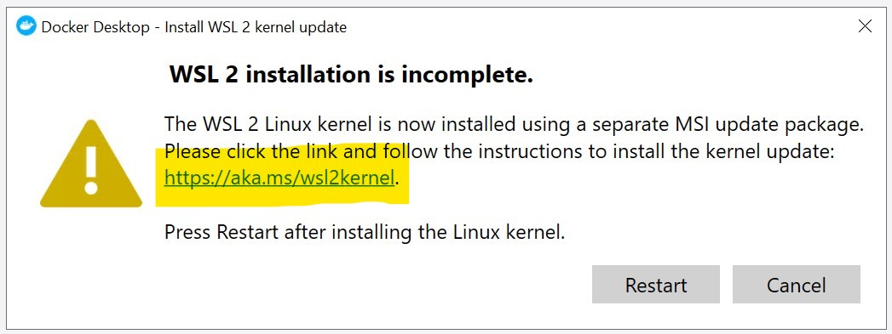

# NoSQL in Action!

NoSQL (Not Only SQL) exercises against relational, key-value, document, graph, and columnar databases.

## Description

- The slides folder contains the material teached during classes.
- The code folder contains the material for the exercises.

## Install

- Install `docker`
    - Windows: https://docs.docker.com/desktop/windows/install/
    - Mac: https://docs.docker.com/desktop/mac/install/
    - Linux: https://docs.docker.com/engine/install/ubuntu/
- Install `docker-compose`
    - Windows and Mac: Docker Compose is already included in Docker Desktop
    - Linux: https://docs.docker.com/compose/install/
- Run docker (sometimes docker has to be (re)started over and over again)
    - Windows
        - Double click on Docker Desktop from the Windows Desktop
        - This warning will pop up, DO NOT close it, but click on the link!
        
        - Download the WSL kernel from here
        
        - Click on restart
        
- Check that docker works by opening a *new* terminal (`cmd.exe` in Windows or `/bin/bash` in Linux) and running `docker run hello-world`
- Install NodeJS (tested with versions 16.13.2 and 17.3.0)
    - https://nodejs.org/en/download/
    - Check that NodeJS works by opening a *new* terminal (`cmd.exe` in Windows or `/bin/bash` in Linux) and running `node --version` (e.g., the output should be `v17.3.1`)
- Install Robo 3T (not Studio 3T): https://robomongo.org/download

## Running the software

### Windows

Two alternatives:
- Unzip and enter the downloaded folder, double click on `openprompt.bat`
- Open a new terminal and run the following commands:

        cd C:\path\to\the\downloaded\folder (replace it with the actual path)
        cd code
        start.bat

- If Windows complains about:
  - Running the scripts

    
    
    and then

    

  - Sharing directories

    

- If everything runs well, the result should be something like:

    

### Linux and MacOS

Open a new terminal and run the following commands:

    cd /path/to/the/downloaded/folder (replace it with the actual path)
    cd code
    sh start.sh

### [Deprecated] Setting up the old software stack

This is the old way, but use it only if docker fails.

- Cassandra: https://s3.amazonaws.com/datastaxtraining/VM/DS220-vm-Jul2015.zip
- Neo4j: https://neo4j.com/artifact.php?name=neo4j-desktop-offline-1.3.11-setup.exe
- MongoDB: https://fastdl.mongodb.org/windows/mongodb-windows-x86_64-4.4.3-signed.msi
    - Robo3T (workbench di MongoDB): https://download.studio3t.com/robomongo/windows/robo3t-1.4.2-windows-x86_64-8650949.exe
    - MongoDB Database Tools (import/export di MongoDB): https://fastdl.mongodb.org/tools/db/mongodb-database-tools-windows-x86_64-100.3.0.zip

## (Tentative) Calendar

<!---
- Lecture 01 (3h): Introduction to NoSQL databases
- Lecture 02 (3h): Cassandra
- Lecture 03 (3h): Test + Cassandra
- Lecture 04 (3h): Cassandra + Neo4J
- Lecture 05 (3h): Neo4J
- Lecture 06 (3h): Neo4J + MongoDB Find
- Lecture 07 (3h): Test Cassandra + MongoDB Find
- Lecture 08 (3h): Test Neo4J + MongoDB Find
- Lecture 09 (3h): MongoDB Find / Aggregate
- Lecture 10 (3h): Test MongoDB + Redis + Real datasets

-->

- Lecture 01 - 28/2 - 14.30/18.30 (4h): Introduction to NoSQL databases (Teoria)
- Lecture 02 - 7/3 - 14.30/17.30  (3h): Teoria, Cassandra
- Lecture 03 - 14/3 - 14.30/18.30 (4h): Cassandra
- Lecture 04 - 17/3 - 14.30/18.30 (4h): [Test teoria](https://forms.gle/yUaMrpZTMDj2tN4QA), Cassandra
- Lecture 05 - 24/3 - 14.30/17.30 (3h): [Test Cassandra](https://forms.gle/gcFwj54gvad9tQ4z5), Neo4J
- Lecture 06 - 28/3  - 14.30/18.30 (4h): Neo4J
- Lecture 07 - 5/4  - 14.30/18.30 (4h): [Test Neo4J](https://forms.gle/SdGf9ydgtPd8FKNP9), MongoDB basis
- Lecture 08 - 14/4 - 9.30/13.30 (4h): [Test MongoDB](https://forms.gle/cVxbCEP2DgRQRH3p7), MongoDB advanced
